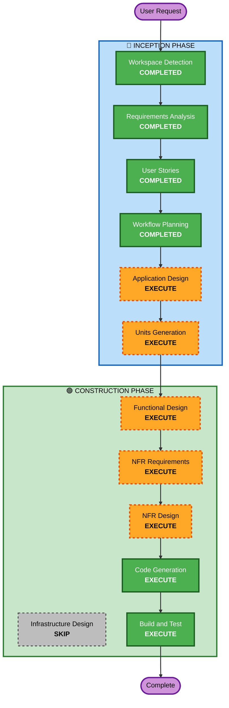

# Execution Plan

## Detailed Analysis Summary

### Change Impact Assessment
- **User-facing changes**: Yes - 고객 주문 UI + 관리자 운영 UI (2개 프론트엔드 앱)
- **Structural changes**: Yes - 풀스택 시스템 신규 구축 (백엔드 + 프론트엔드 2개 + DB)
- **Data model changes**: Yes - 전체 데이터 모델 신규 설계 필요
- **API changes**: Yes - REST API 전체 신규 설계
- **NFR impact**: Yes - 실시간 SSE, JWT 인증, 보안 요구사항

### Risk Assessment
- **Risk Level**: Medium (신규 프로젝트이므로 기존 시스템 영향 없음, 단 복잡도 중~상)
- **Rollback Complexity**: Easy (Greenfield - 롤백 불필요)
- **Testing Complexity**: Moderate (SSE 실시간 통신, 세션 관리 테스트 필요)

---

## Workflow Visualization



### Text Alternative
```
Phase 1: INCEPTION
- Workspace Detection (COMPLETED)
- Requirements Analysis (COMPLETED)
- User Stories (COMPLETED)
- Workflow Planning (COMPLETED)
- Application Design (EXECUTE)
- Units Generation (EXECUTE)

Phase 2: CONSTRUCTION (per-unit)
- Functional Design (EXECUTE)
- NFR Requirements (EXECUTE)
- NFR Design (EXECUTE)
- Infrastructure Design (SKIP)
- Code Generation (EXECUTE)
- Build and Test (EXECUTE)
```

---

## Phases to Execute

### 🔵 INCEPTION PHASE
- [x] Workspace Detection (COMPLETED)
- [x] Requirements Analysis (COMPLETED)
- [x] User Stories (COMPLETED)
- [x] Workflow Planning (IN PROGRESS)
- [ ] Application Design - **EXECUTE**
  - **Rationale**: 신규 프로젝트로 컴포넌트 식별, 서비스 레이어 설계, 컴포넌트 간 의존성 정의 필요
- [ ] Units Generation - **EXECUTE**
  - **Rationale**: 풀스택 시스템(백엔드 + 프론트엔드 2개)으로 다수 유닛 분해 필요

### 🟢 CONSTRUCTION PHASE (per-unit)
- [ ] Functional Design - **EXECUTE**
  - **Rationale**: 데이터 모델, 비즈니스 로직(주문 상태 전이, 세션 관리), API 설계 필요
- [ ] NFR Requirements - **EXECUTE**
  - **Rationale**: 보안(JWT, bcrypt), 실시간 통신(SSE), 성능 요구사항 존재
- [ ] NFR Design - **EXECUTE**
  - **Rationale**: NFR Requirements에서 도출된 패턴을 설계에 반영 필요
- [ ] Infrastructure Design - **SKIP**
  - **Rationale**: MVP 단계에서는 AWS 배포 상세 설계보다 애플리케이션 구현에 집중. 인프라는 Build and Test에서 기본 배포 가이드로 대체
- [ ] Code Generation - **EXECUTE** (ALWAYS)
  - **Rationale**: 실제 코드 구현 필수
- [ ] Build and Test - **EXECUTE** (ALWAYS)
  - **Rationale**: 빌드 및 테스트 지침 필수

### 🟡 OPERATIONS PHASE
- [ ] Operations - **PLACEHOLDER**
  - **Rationale**: 향후 배포/모니터링 워크플로우 확장 예정

---

## Success Criteria
- **Primary Goal**: 단일 매장용 테이블오더 MVP 시스템 완성
- **Key Deliverables**:
  - Spring Boot 백엔드 API 서버
  - React 고객용 주문 앱
  - React 관리자용 운영 앱
  - MySQL 데이터베이스 스키마
  - 빌드 및 테스트 지침
- **Quality Gates**:
  - 모든 API 엔드포인트 동작 확인
  - SSE 실시간 주문 알림 동작
  - JWT 인증/인가 동작
  - Security Baseline 규칙 준수
  - PBT (Partial) 규칙 준수
